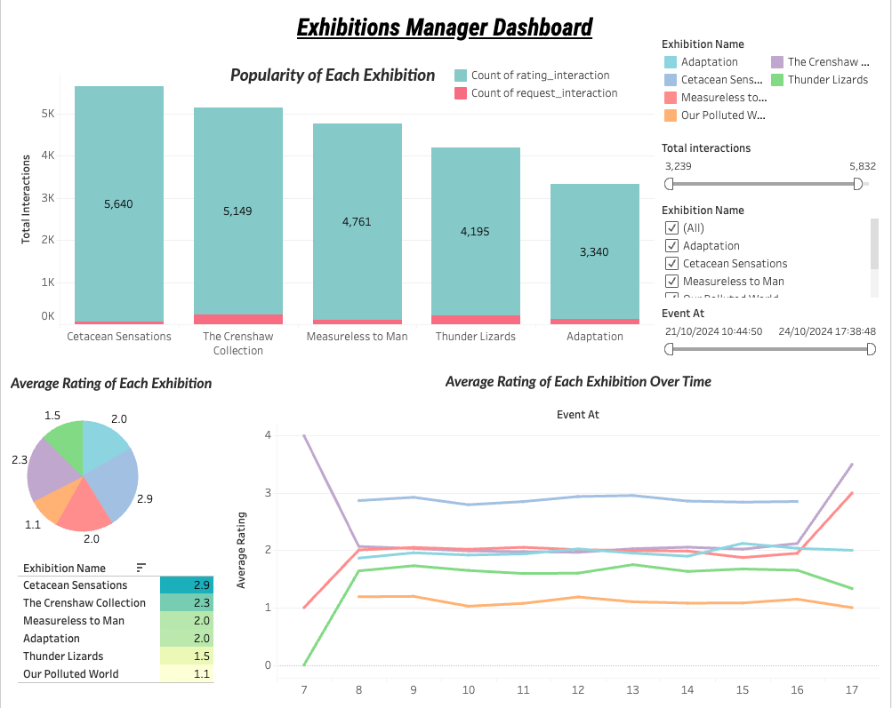
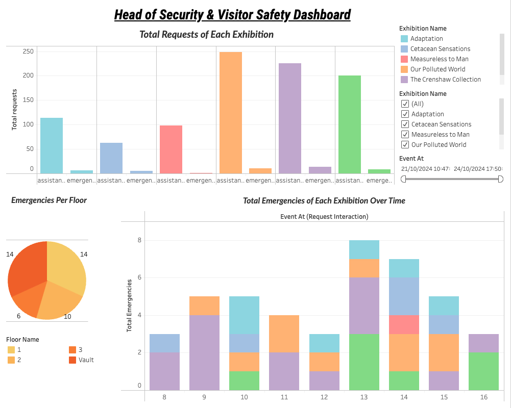
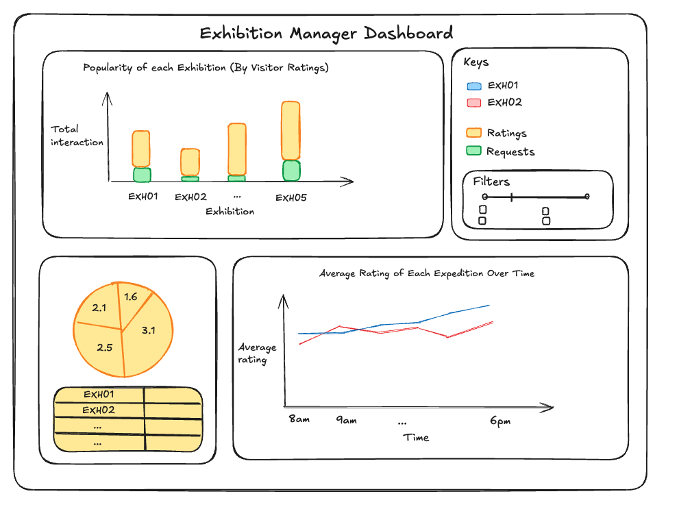
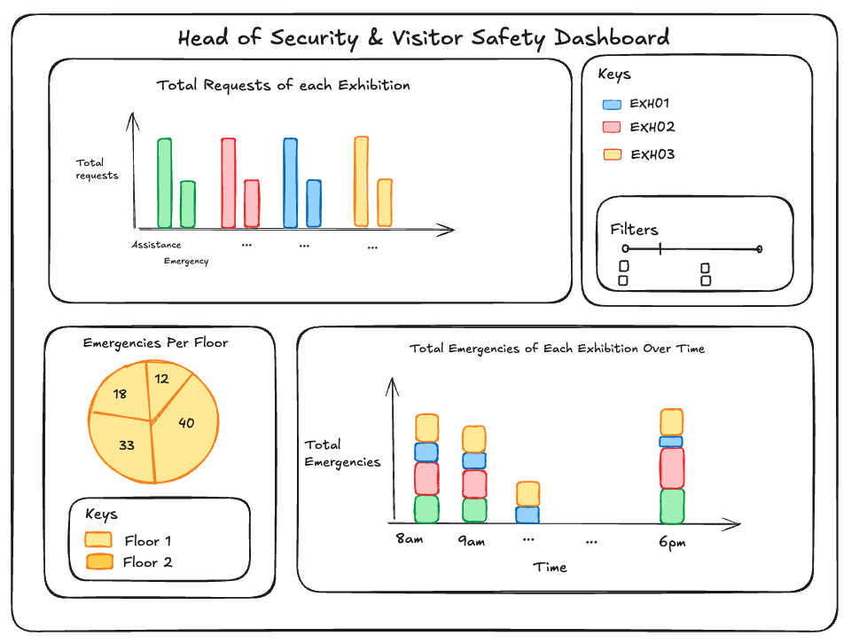

# Dashboard

##  Overview
This folder contains a summary of the dashboards for the stakeholders, with recommendations for decision-making.
- Images of the Tableau dashboard visualisations and wireframe designs
- Brief explanation of the dashboard metrics
- Recommendations

## Dashboard for the Exhibitions Manager
**Angela Millay (Exhibitions Manager)**
**Key Focus:** *Exhibition engagement and satisfaction.*

1. Total interactions by Exhibition: Displays the popularity of each exhibition by tracking the number of rating and request interactions each site has.
2. Visitor Ratings by Exhibition: Displays overall average satisfaction ratings for each exhibition. The table (bottom left) below it is colour coded and sorted to display:
- Top-Performing Exhibitions: Highlight exhibitions with the highest satisfaction levels to help Angela identify successful ones.
- Low-Performing Exhibitions: Flag exhibitions with low ratings for potential improvement.
3. Visitor Ratings by Exhibition (Line Graph): Displays average satisfaction for each exhibition over time which would help her quickly identify when engagement and performance changes over time.

**Summary:** This enables Angela to track which exhibition is the most popular and measure it against the average rating of that exhibition e.g. The Cetacean Sensations exhibition is the most popular Exhibition and also has the best performance.

## Dashboard for the Head of Security & Visitor Safety
**Rita Pelkman (Head of Security & Visitor Safety)**
**Key Focus:** *Assistance and emergency requests, visitor safety.*

1. Request Frequency by Exhibition: Display the number of assistance or emergency requests per exhibition. This can show which exhibits may need more staff presence.
2. Trends in Assistance Requests: A trend line for assistance requests to spot potential issues, such as recurring visitor confusion or concerns in certain exhibitions.
3. Number of Emergency Requests: Show where emergency requests occur most frequently, helping her prioritize staff deployment.
4. Pie chart that breaks down which floor has the most emergencies and a bar chart that displays the exhibition and time where most emergencies occur.
5. Real-Time Alerts: A live feed of assistance and emergency requests as they are logged.

**Summary** This enables Rita to track which exhibition has the most assistance and emergency requests. Focusing deeper into emergency requests, Rita can evaluate where emergencies are most prevalent (in terms of floor number, exhibition and time) and quickly spot and respond to emergencies as they update in real-time. For example, the Crenshaw Collection is the Exhibit that has the most emergency requests occurring at 9am. This exhibition is also on floor 1 where emergencies are most prevalent.

**Shared Elements**
- Filtering by Date: Include a date filter to allow Angela and Rita to view specific time periods, such as the last month or the opening week of an exhibition.
- Location Filtering: Let users filter data by exhibition, helping them see detailed performance across different areas of the museum.
- Comparison Over Time: A tool for comparing how exhibitions or requests performed over various periods (e.g., week-on-week, month-on-month).

## Wireframes for the Dashboard Designs for each Stakeholder

